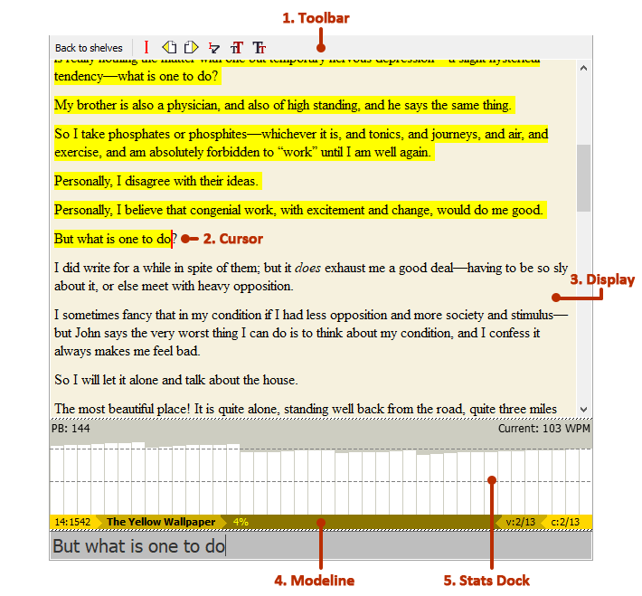
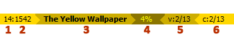

Book View
=========

1. Toolbar
    The bar at the top of the view, which contains :ref:`common Book-View-specific actions <toolbar-actions>`.
2. Cursor
    Represents the current position in the text.
3. Display
    The main book display which contains the text to be typed, with the text already typed highlighted in yellow.
4. :ref:`modeline`
    The bar at the bottom of the view, which contains some information about the book and the current position therein.
5. :ref:`stats-dock`
    A collapsible and resizeable dock which displays statistics on the user’s typing rate in WPM (words per minute).

.. _toolbar-actions:

Toolbar actions
---------------

- Back to shelves
   Return to :doc:`shelf-view`.
- Cursor position
   Go to the cursor position. Hold :kbd:`Ctrl` to instead move cursor to your current position.
- Previous chapter
   Go to the previous chapter. Hold :kbd:`Ctrl` to move cursor with you as well.
- Next chapter
   Go to the next chapter. Hold :kbd:`Ctrl` to move cursor with you as well.
- Skip line
   Move cursor to the next line.
- Increase font size
   Increase the Display’s font size.
- Decrease font size
   Decrease the Display’s font size.

..
   possibly should be generated from the dict in book_view as well, like the console commands? the issue is the tooltip there needs to be short while here we could have more information. however, i could simply add there a 'desc' attr with a longer description and use that.

Most of these actions have corresponding :ref:`console-commands`.

The font size can also be increased or decreased using the mousewheel while holding :kbd:`Ctrl`.

.. _modeline:

Modeline
--------

1. Line position
    The line position of the cursor in the current chapter.
2. Cursor position
    The raw cursor position in the current chapter.
3. Book title
    The title of the book currently loaded.
4. Percentage completed
    How far through the book the cursor is located.
5. Chapter position (view)
    The chapter position of the chapter currently viewed.
6. Chapter position (cursor)
    The chapter position of the cursor.

.. _stats-dock:

Stats Dock
----------

The Stats Dock is the graph above the Modeline. It can be resized or collapsed using the drag handle above it. It contains the following main elements:

#. PB
    The personal best WPM (words per minute) typing speed achieved in the current session.
#. Current
    The current typing speed in WPM.
#. Rectangles
    Each rectangle’s height represents the WPM achieved as a proportion of the PB. New rectangles appear on the right; the right-most rectangle represents the current WPM.
#. Dashed lines
    Dashed lines appear every 50 WPM and are there to help gauge the WPM each rectangle represents. For example, a rectangle whose height matches the first dashed line from the bottom represents 50 WPM.

The Stats Dock updates on every letter typed correctly.
