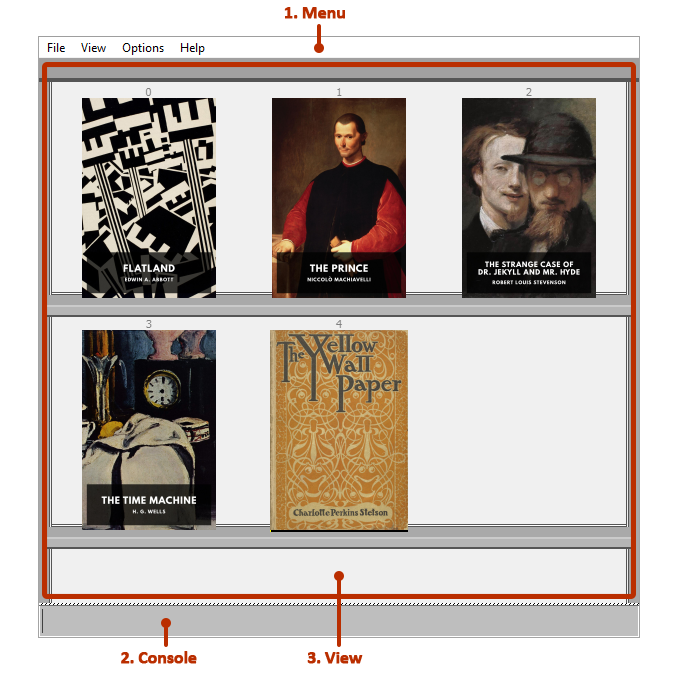

Main Window
===========

*retype*’s Main Window is composed of 3 main elements:

1. Menu
    A dropdown menu at the top of the screen that provides quick-access to actions that are not context-sensitive, such as opening the :doc:`customisation-dialog`.
2. :doc:`console`
    An input line at the bottom of the screen which is used for entering :ref:`console-commands` and, in book view, to type along to books and advance the cursor.
3. View
    Changes between :doc:`shelf-view` and :doc:`book-view`.
