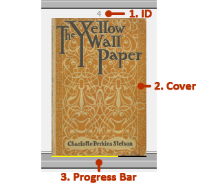

Shelf View
==========

The Shelf View is composed of the covers of the epub books that retype was able to find in the :ref:`library-search-paths` resting on shelves.

1. ID
    A numerical ID assigned to the book.
2. Cover
    The book’s cover, which when hovered over dims and displays the book’s name, and when clicked on loads the book and switches to :doc:`book-view`.
3. Progress Bar
    The yellow represents how far through the book the cursor is located. When the book is completed, it turns green. 
